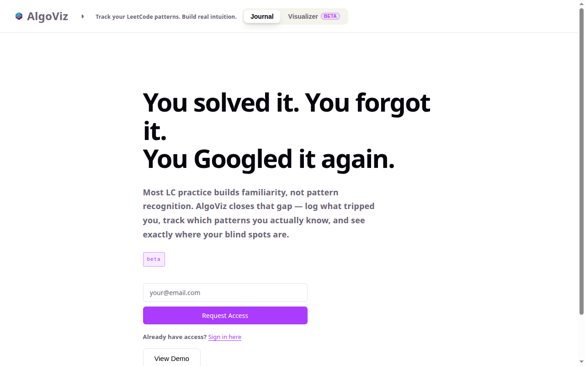
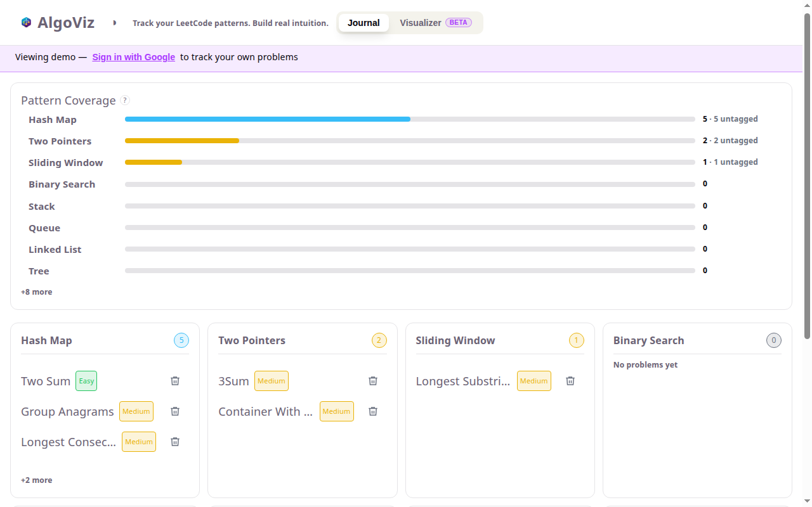
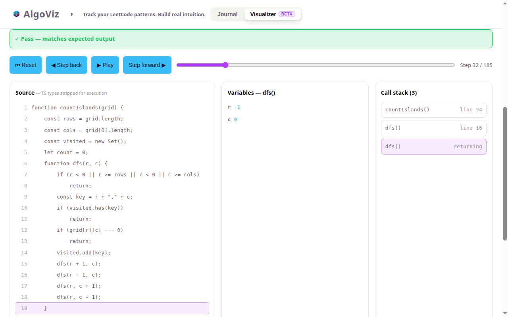

# AlgoViz

**[algoviz-ruby.vercel.app](https://algoviz-ruby.vercel.app)**

A deliberate-practice journal for LeetCode. Most practice trackers log that you solved a problem — AlgoViz logs whether you'd recognize the *pattern* next time, so you can see your actual blind spots instead of a streak counter.



## Why

Solving a problem once builds familiarity, not recall. AlgoViz separates the two by asking you to name the pattern, explain your approach in your own words, and note what tripped you up — then rolls that up into per-pattern coverage so gaps are visible instead of buried in a list.

## Features

- **Pattern-based journal** — log problems by name, number, pattern(s), difficulty, and time/space complexity, plus free-text fields for what tripped you up and how you'd explain the solution
- **Auto-fill from LeetCode data** — problem name, difficulty, and contest rating (when one exists) fill in from the problem number
- **Pattern coverage dashboard** — per-pattern counts and solve-status breakdown (cold / guided / untagged) so weak spots stand out
- **Visualizer (beta)** — paste a function or component and step through its execution, line by line, with live variables and a call stack, to build intuition before journaling it
- **Google OAuth**, per-user data isolated via Supabase Row Level Security
- **Demo mode** — try the full journal and dashboard with sample data, no account required

| Pattern coverage dashboard | Execution Visualizer |
| --- | --- |
|  |  |

## Stack

React · TypeScript · Vite · Supabase (Postgres + Auth) · Vercel

## Getting started

```bash
git clone https://github.com/SalasC2/algoviz.git
cd algoviz
npm install
```

Copy `.env.example` to `.env` and fill in a Supabase project's client credentials:

```bash
cp .env.example .env
```

```bash
npm run dev       # start the dev server
npm run build     # type-check and build for production
npm run lint      # lint
npm run preview   # preview a production build locally
```

## Deployment

Deployed on Vercel. Pushes to `main` deploy to production; other branches get preview deployments. Environment variables are managed through the Vercel dashboard and must be set there separately from local `.env`.

## License

MIT — see [LICENSE](LICENSE).
